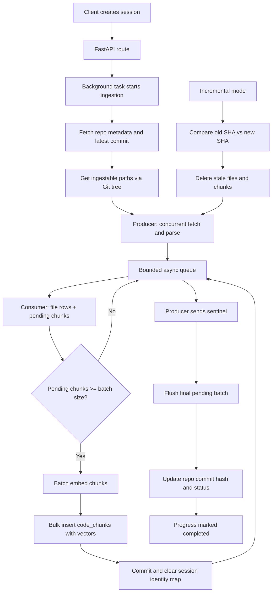

# Ingestion Pipeline Cheat Sheet

## Purpose

The ingestion pipeline turns a GitHub repository into searchable, embedded code chunks for RAG chat.

Primary goals:

- Keep request latency low by running ingestion in background tasks.
- Minimize external API calls and avoid unnecessary file processing.
- Maximize throughput with concurrent fetch/parse plus batched embed/store.
- Keep memory usage stable with bounded queues and periodic session cleanup.

## Architecture Diagram

## End-to-End Flow

1. Session is created and ingestion is scheduled as a background task.
2. Repo metadata and latest commit SHA are fetched.
3. File paths are collected with a single recursive Git tree call.
4. Files are concurrently fetched and parsed into chunks.
5. Consumer buffers chunks across files.
6. Buffered chunks are embedded in batches.
7. Embedded chunks are bulk inserted into PostgreSQL/pgvector.
8. Repo commit hash and status are finalized.

## Why It Is Fast and Efficient

### 1) API call reduction

- Uses a recursive Git tree call to gather candidate file paths in one pass.
- Filters files early (size, directories, extensions, known lock files).
- Caps file count and repo size to avoid pathological repositories.
- Uses incremental ingestion to process only changed paths after the initial ingest.

Impact:

- Fewer GitHub API calls.
- Less parsing and embedding work.
- Lower total ingestion time and cost.

### 2) Batching strategy

Two batching layers are used:

- Pipeline batch: chunks from multiple files are buffered up to a batch threshold.
- Embedding batch: buffered texts are grouped by token budget before calling OpenAI embeddings.

Impact:

- Fewer embedding API calls.
- Better throughput per call.
- Lower overhead and reduced rate-limit pressure.

### 3) Producer/consumer pipeline

- Producer concurrently fetches and parses files.
- Consumer serializes DB interactions and manages chunk buffering.
- A bounded queue provides backpressure so producer cannot outrun consumer.

Impact:

- Fetch/parse work overlaps with embed/store work.
- Stable memory usage under load.
- Predictable behavior on large repos.

### 4) Async and concurrency model

- Main pipeline runs in asyncio.
- Blocking operations are offloaded with thread workers.
- Fetch concurrency is semaphore-limited for controlled parallelism.
- Producer and consumer run together via asyncio.gather.

Impact:

- High utilization without blocking the event loop.
- Configurable parallelism.
- Better overall throughput than sequential processing.

### 5) Worker roles

There are two worker concepts:

- Request worker: FastAPI background task launches ingestion off the request path.
- Pipeline workers: thread-backed tasks handle fetch/parse and embedding calls.

This is in-process concurrency, not a separate distributed queue system.

### 6) Efficient database writes

- Files are added and flushed to get file IDs without committing every row.
- Code chunks are inserted with bulk insert maps.
- Commits are done per batch rather than per chunk.
- SQLAlchemy identity map is cleared between batches to keep memory stable.
- content_tsv is computed at insert time by PostgreSQL, avoiding extra write passes.

Impact:

- Fewer DB round trips.
- Better insert throughput.
- Lower memory growth during large ingests.

## Incremental Ingestion Fast Path

When a repository already exists:

- Compare stored commit SHA with latest SHA.
- Build changed path sets from GitHub compare.
- Delete stale rows for changed/removed files.
- Reingest only changed files.

This avoids full reprocessing and dramatically cuts ingest time for small updates.

## Cancellation and Recovery

- Progress state tracks stage, counts, and elapsed time.
- Cancellation flag is polled inside the consumer loop and before heavy batch work.
- Interrupted ingestions are recoverable by marking stuck repos as failed on startup.

## Tuning Knobs

Tune these for your deployment profile:

- Fetch workers
- Queue max size
- Embed batch size
- Max files per repo
- Max file size
- Max repo size
- Embedding token batch budget

## Operational Notes

- Current model is simple and efficient for moderate throughput.
- A distributed worker system is only needed if you require durable retries and horizontal multi-instance job scaling.
